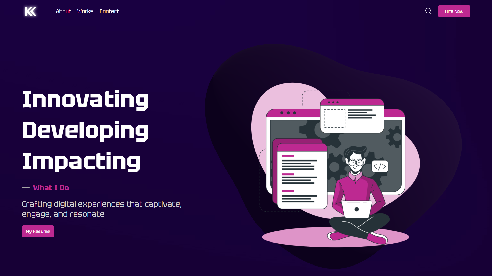

# My Portfolio Website

Welcome to the repository of my personal portfolio website! This website showcases my skills, projects, and achievements in the field of Development. Feel free to explore the different sections of the website to get to know me better.

## Live Website

You can visit the live version of the website at [https://www.your-portfolio-website.com](https://www.your-portfolio-website.com)

## Table of Contents

- [Features](#features)
- [Technologies Used](#technologies-used)
- [Getting Started](#getting-started)
- [Usage](#usage)
- [Contributing](#contributing)
- [License](#license)

## Features

- **About Me:** Learn about my background, skills, and experiences.
- **Portfolio:** Browse through the projects I've worked on, along with descriptions and links.
- **Resume:** Download a PDF version of my resume.
- **Contact:** Reach out to me through the provided contact information.
- **Responsive Design:** The website is designed to work well on various devices and screen sizes.

## Technologies Used

- HTML5, CSS3, JavaScript
- ReactJS
- Three-JS
- Styled Components

## Getting Started

To run the website locally on your machine, follow these steps:

1. Clone this repository: `git clone https://github.com/KetanKarki/My-Portfolio-Website.git`
2. Navigate to the project directory: `cd your-portfolio-website`
3. Type npm start or yarn run dev in your terminal

## Reference

This portfolio was created by taking reference from lamadev. You can check out his channel at https://www.youtube.com/c/lamadev/videos

## Contributing

Contributions are welcome! If you find any issues or want to improve the website, feel free to submit a pull request. If you have suggestions or feedback, please open an issue and let's discuss.

1. Fork the repository.
2. Create a new branch: `git checkout -b feature/new-feature`
3. Make your changes and commit them: `git commit -am 'Add new feature'`
4. Push to the branch: `git push origin feature/new-feature`
5. Open a pull request.

---

Thank you for visiting my portfolio repository! If you have any questions or would like to get in touch, feel free to reach out to me through the contact information provided on the website.

[https://www.your-portfolio-website.com](https://www.your-portfolio-website.com)
